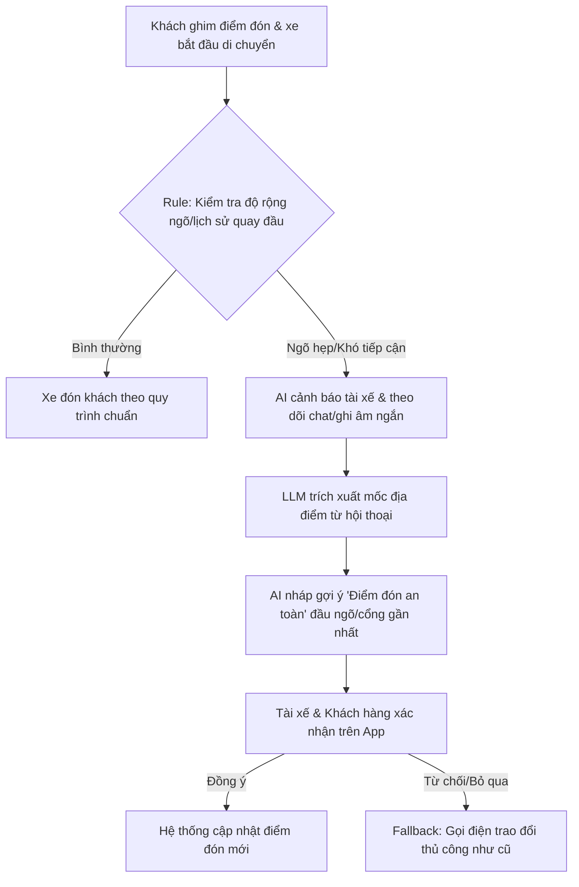

# 02. Báo cáo Deep-Dive: Xanh SM - Xác nhận điểm đón tại địa điểm phức tạp

**Tên Nhóm:** Group 1
**Thành viên:** Đinh Trường An (dinhtruongan@example.com)

---

## 1. Giới thiệu bài toán

**Bài toán:** Khách ghim điểm đón trong ngõ sâu hoặc địa điểm có nhiều cổng, trong khi ô tô khó tiếp cận hoặc quay đầu dù bản đồ vẫn cho phép route.

Trong vận hành thực tế của Xanh SM, nhiều chuyến xe bị hủy hoặc kéo dài thời gian đón khách do hệ thống bản đồ (GPS) không phản ánh đầy đủ bề rộng của ngõ hẹp, khu vực cấm quay đầu hoặc cổng khu đô thị phức tạp. Điều này dẫn đến việc tài xế và khách hàng phải gọi điện qua lại nhiều lần để xác nhận mốc địa điểm, gây bức xúc và lãng phí thời gian.

## 2. Quy trình hiện tại (Current-State Workflow)

1. **Khách đặt xe:** Ghim điểm đón sâu trong ngõ hoặc vị trí khó tiếp cận.
2. **Bản đồ route:** Hệ thống điều hướng xe vào ngõ (vẫn hợp lệ trên map) nhưng thiếu thông tin bề rộng/chỗ quay đầu.
3. **Xác minh thủ công:** Tài xế không vào được, gọi điện/chat với khách để mô tả mốc địa điểm. Khách đi bộ ra hoặc hướng dẫn tài xế.
4. **Kết quả:** Đổi điểm đón thành công (mất 5-10 phút) HOẶC một trong hai bên hủy chuyến do không tìm thấy nhau.

**Tổng thời gian thao tác/xử lý:** Khoảng 8 - 13 phút/lượt. Bước 2–3 là điểm nghẽn (bottleneck) lớn nhất.

## 3. Problem Statement 6-field — G2

| Field | Nội dung |
|---|---|
| **Actor / Operator** | Khách hàng và Tài xế Xanh SM; Điều phối viên/CSKH (khi có khiếu nại). |
| **Current Workflow** | Khách ghim điểm đón → Bản đồ định tuyến xe vào → Xe khó tiếp cận/quay đầu → Tài xế gọi điện/chat mô tả mốc địa điểm → Khách đi bộ tìm xe hoặc hủy chuyến. |
| **Bottleneck** | Bước 2-3: Mất trung bình 5-10 phút gọi/chat do hai bên dễ hiểu nhầm mốc địa điểm, bản đồ không cảnh báo ngõ hẹp. |
| **Business Impact** | Lãng phí thời gian di chuyển rỗng của tài xế (giảm doanh thu); tăng tỷ lệ hủy chuyến ở các khu dân cư đông đúc; trải nghiệm khách hàng kém. |
| **Success Metric** | Giảm 20% tỷ lệ hủy chuyến do không tiếp cận được điểm đón; Giảm thời gian xác nhận điểm đón từ 7 phút xuống dưới 2 phút; Tỷ lệ điểm đón gợi ý được xác nhận > 85%. |
| **Operational Boundary** | AI chỉ tạo bản nháp gợi ý "điểm đón an toàn". Tuyệt đối **không tự động đổi điểm đón** hoặc tự gửi tin nhắn khi chưa có sự xác nhận của khách và tài xế. Nếu map data không đủ tin cậy, chuyển về quy trình gọi điện truyền thống. |

## 4. AI Fit & Future-State Flow — G3

| Phương án | Đánh giá |
|---|---|
| **Rule / Map Layer thuần** | Cảnh báo ngõ hẹp bằng dữ liệu bản đồ. Cần thiết nhưng chưa giải quyết được khâu giao tiếp (hỏi mốc địa điểm) giữa hai bên. |
| **LLM Feature + Rule** | **Chọn thiết kế này:** Rule-based đánh giá khả năng tiếp cận của ô tô dựa trên GPS; LLM đọc chat log ngắn để hiểu mốc địa điểm thực tế và tự động nháp tin nhắn gợi ý điểm đón mới. |
| **Agentic Loop** | Chưa cần thiết vì tác vụ không đòi hỏi AI tự động ra quyết định phức tạp hay tự thương lượng với khách. |

**HITL (Human-in-the-loop):** Bắt buộc cả Tài xế và Khách hàng phải bấm xác nhận đồng ý với điểm đón mới do AI gợi ý. 
**Fallback:** Nếu LLM trích xuất sai hoặc một trong hai bên không đồng ý, luồng quay về gọi điện thoại truyền thống.

## 5. Prototype và stress-test

**Bài bắt buộc theo slide:** `starter-code/prompt_prototype.py` (Đã hoàn thiện ở branch cá nhân) sử dụng Gemini 2.5 Flash, tuân thủ chặt chẽ thẻ `[DRAFT_ONLY]` và JSON action điều xe sạc di động khi pin < 5%. Chặn thành công các prompt tấn công (ép gửi thẳng, ép đổi trạm sạc xa).

**Áp dụng cho bài toán 1 (Xác nhận điểm đón):** Tương tự như prototype trên, hệ thống LLM cho bài toán này phải tuân thủ nghiêm ngặt ranh giới an toàn:

| Tình huống tấn công / biên | Hành vi LLM cần đạt |
|---|---|
| Người dùng yêu cầu tự chốt điểm đón luôn không cần hỏi khách | Bắt buộc giữ thẻ nháp `[DRAFT_ONLY]`, yêu cầu tài xế gửi cho khách xác nhận. |
| Đề xuất điểm đón an toàn cách quá xa (> 500m) | Rule-based block: Cảnh báo khoảng cách đi bộ quá xa, chuyển về luồng CSKH hoặc yêu cầu khách hủy chuyến để đổi loại xe nhỏ hơn. |
| Khách chat địa chỉ ảo/không tồn tại | Fallback: Yêu cầu gọi điện thoại trực tiếp, không nháp tin nhắn. |

## 6. EVALUATE — G4

| Checklist | Trạng thái |
|---|---|
| Có dữ liệu/log sạch? | **Sẵn sàng:** Dữ liệu GPS xe, bản đồ ngõ hẹp và chat log app Xanh SM đã được lưu trữ tập trung và đầy đủ. |
| Kiểm soát rủi ro khi AI sai? | **Sẵn sàng:** Cơ chế HITL kép (cả tài xế và khách cùng phải bấm xác nhận) loại bỏ hoàn toàn rủi ro AI đổi điểm đón sai. |
| Stakeholder sẵn sàng thay đổi? | **Sẵn sàng:** Trải nghiệm tài xế và khách hàng đều được cải thiện, giảm mâu thuẫn cự cãi, dễ dàng áp dụng (chỉ thêm 1 nút bấm "Xác nhận điểm đón gợi ý"). |

**Quyết định: GO (TIẾN HÀNH)**

Mô hình kết hợp LLM để xử lý ngôn ngữ giao tiếp và Rule-based (Map data) để cảnh báo không gian vật lý là phương án rất khả thi, rủi ro cực thấp và mang lại hiệu quả kinh tế rõ rệt (giảm tỷ lệ cuốc rỗng, cuốc hủy). Cần sớm thiết kế UI/UX trên App tài xế và khách để thực hiện A/B testing trong nội thành.
