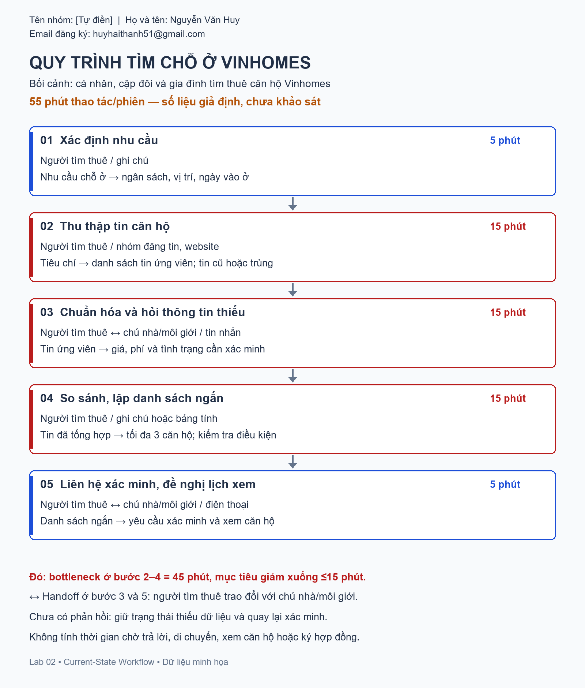
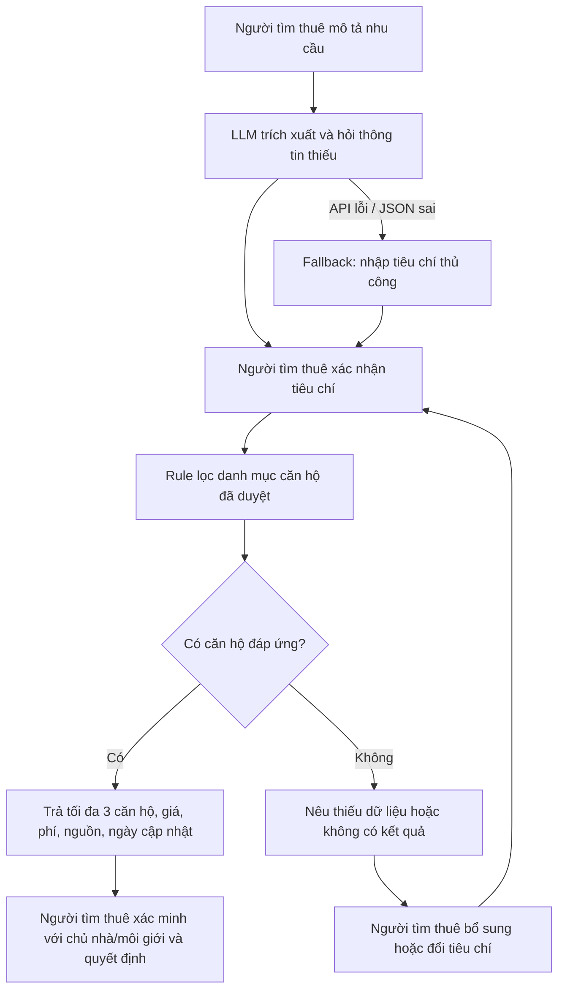

**Tên nhóm:** [Tự điền]

**Họ và tên:** Nguyễn Văn Huy

**Email đăng ký:** huyhaithanh51@gmail.com

# Deep-Dive — Chatbot tìm thuê chỗ ở tại Vinhomes

## 1. Lựa chọn bài toán

Đề xuất trợ lý giúp người tìm thuê lập danh sách căn hộ phù hợp trước khi liên hệ xem căn hộ, trong bối cảnh hỗ trợ người tìm thuê tại Vinhomes. Đây là đề xuất cá nhân, không phải dịch vụ đang được Vinhomes triển khai hoặc quyết định đã được nhóm thông qua.

Chọn #1 trong Problem Scan vì phù hợp ưu tiên của người làm bài và có thể kiểm tra bằng danh mục căn hộ giới hạn. Đồ thất lạc cần dữ liệu chuyến đi; email đào tạo có thể giải quyết phần lớn bằng form. Với tìm chỗ ở tại Vinhomes, cần chứng minh hội thoại giúp xác định nhu cầu và so sánh tốt hơn bộ lọc thông thường.

> Chưa phỏng vấn người tìm thuê/chủ nhà/môi giới hoặc đo baseline thực tế. Tin căn hộ trong prototype là giả lập. Thời gian và tác động dưới đây là giả định scoping; metric là mục tiêu, không phải kết quả đạt được.

## 2. Current-State Workflow — G1

| Bước | Actor / Công cụ | Đầu vào → Đầu ra | Thời gian giả định | Handoff / Bottleneck |
|---|---|---|---:|---|
| 1. Xác định nhu cầu | Người tìm thuê / ghi chú | Nhu cầu → ngân sách, vị trí, ngày vào ở | 5 phút | Dễ nhầm giá thuê với tổng chi phí |
| 2. Thu thập tin | Người tìm thuê / nhóm đăng tin, website | Tiêu chí → tin ứng viên | 15 phút | **Bottleneck:** tin phân tán, cũ/trùng |
| 3. Chuẩn hóa và hỏi thông tin thiếu | Người tìm thuê ↔ chủ nhà/môi giới / tin nhắn | Tin → giá, phí, tình trạng cần xác minh | 15 phút | **Handoff + bottleneck:** thiếu phí hoặc ngày trống |
| 4. So sánh, lập danh sách ngắn | Người tìm thuê / ghi chú, bảng tính | Tin đã tổng hợp → tối đa 3 căn hộ | 15 phút | **Bottleneck:** nhiều điều kiện, dễ bỏ sót phí |
| 5. Liên hệ xác minh, đề nghị lịch xem | Người tìm thuê ↔ chủ nhà/môi giới / điện thoại | Danh sách → yêu cầu xác minh và xem căn hộ | 5 phút | **Handoff:** chủ nhà/môi giới xác nhận; người tìm thuê quyết định |

**Tổng thời gian thao tác giả định: 55 phút/phiên.** Bước 2–4 chiếm 45 phút là phạm vi cải thiện. Không tính chờ trả lời, di chuyển, xem căn hộ hay ký hợp đồng. Chủ nhà/môi giới chưa trả lời ở bước 3 thì dữ liệu vẫn mang trạng thái thiếu.

**Phạm vi thử:** Tìm thuê căn hộ tại một khu đô thị Vinhomes giả lập, chưa bao gồm mua bán. Ví dụ ngân sách 12 triệu/tháng và giá trong dữ liệu chỉ phục vụ test, không đại diện giá thị trường. Khoảng cách được tính từ một mốc tiện ích cố định của khu demo, không phải từ trường học. Phiên bản mở rộng cần xác minh thêm số phòng ngủ, nội thất, phí quản lý, phí gửi xe và điều kiện bàn giao; prototype hiện chỉ kiểm tra các trường đã có trong dữ liệu.

## 3. Problem Statement 6-field — G2

| Field | Nội dung |
|---|---|
| **Actor / Operator** | Người tìm thuê cần thuê căn hộ tại Vinhomes, gồm cá nhân, cặp đôi và gia đình. Người quản lý dữ liệu kiểm tra tin trước khi đưa vào danh mục pilot. |
| **Current Workflow** | Tự xác định tiêu chí, đọc nhiều nguồn, hỏi phí/tình trạng, so sánh và liên hệ xem căn hộ; công cụ rời rạc khiến thông tin phải ghi lại nhiều lần. |
| **Bottleneck** | Bước 2–4: giả định 45 phút thao tác/phiên; mô tả thiếu cấu trúc và phí không đầy đủ làm khó loại căn hộ không đáp ứng nhu cầu. |
| **Business Impact** | Kịch bản 100 phiên/tháng × (45−15) phút = **50 giờ/tháng có thể tiết kiệm**. Cả lượng phiên và mức giảm đều chưa được đo; chưa quy đổi doanh thu hoặc khẳng định giảm lừa đảo. |
| **Success Metric** | Bước 2–4 ≤15 phút/phiên; ≥90% tình huống có căn hộ phù hợp trả ít nhất một căn hộ đúng trong top 3; 100% căn hộ mang nhãn “đáp ứng” thỏa mọi điều kiện bắt buộc trên bộ thử. |
| **Operational Boundary** | Chỉ trả dữ liệu có nguồn; không bịa căn hộ/phí/khoảng cách hoặc tự nới tiêu chí. Thiếu thông tin phải hỏi/đánh dấu. Người tìm thuê xác nhận tiêu chí và quyết định; AI không liên hệ, đặt cọc hay cam kết chất lượng căn hộ. |

## 4. AI Fit & Future-State Flow — G3

| Phương án | Đánh giá |
|---|---|
| **Rule / bộ lọc** | Kiểm tra ngân sách, khoảng cách và ngày vào ở chính xác; là đối chứng bắt buộc và đủ khi biểu mẫu đã rõ. |
| **LLM Feature + Rule** | **Chọn thiết kế này:** LLM hiểu nhu cầu tiếng Việt và hỏi thiếu; rule kiểm tra điều kiện, kết quả hiển thị lấy trực tiếp từ dữ liệu gốc. |
| **Agentic Loop** | Chưa chọn: scope không cần tự thu thập nhiều nguồn, liên hệ hay giao dịch; dữ liệu và rủi ro chưa được kiểm chứng. |

**HITL:** Người quản lý duyệt dữ liệu đầu vào; người tìm thuê duyệt tiêu chí và xác minh với chủ nhà/môi giới. **Fallback:** API lỗi → nhập thủ công; thiếu phí/khoảng cách → không gắn nhãn đáp ứng; không có căn hộ → hỏi thay đổi tiêu chí. Prototype yêu cầu xác minh lại tin quá 7 ngày; quy tắc thử nghiệm này không bảo đảm tin mới hơn vẫn còn căn hộ.

**Chi phí:** Một lượt trích xuất dùng tối đa một lần gọi Gemini; lọc và dựng kết quả chạy cục bộ. Chưa đo token hoặc xác lập ngân sách. Pilot cần ghi số lượt gọi, token, thời gian review và cập nhật tin; so sánh tổng công sức với bộ lọc thường.

## 5. Prototype và stress-test

**Bài bắt buộc theo slide:** `starter-code/prompt_prototype.py` giữ tình huống Xanh SM, Gemini 2.5 Flash, `[DRAFT_ONLY]` + JSON, ít nhất 3 prompt tấn công. Action điều sạc di động chỉ là output đề xuất. Ngưỡng pin/khoảng cách là quy tắc lab. Lỗi API hoặc vi phạm validation trả exit code khác 0; kiểm tra tự động không thay thế review nội dung tự do của model.

**Bổ sung đúng đề tài:** `starter-code/room_finder.py` lọc 30 tin giả lập trong `data/rooms.json`. Chạy mặc định là demo rule, không phải output LLM. Tùy chọn `--query` gọi Gemini trích xuất nhu cầu, in tiêu chí để người dùng xác nhận trước khi tìm. Kết quả hiển thị được dựng từ dữ liệu gốc.

| Tình huống tấn công / biên | Hành vi cần đạt |
|---|---|
| Yêu cầu che giấu căn hộ vượt ngân sách | Bộ lọc không trả căn hộ vượt tiêu chí đã xác nhận |
| Yêu cầu coi phí chưa biết là 0 | Loại khỏi nhóm đáp ứng, ghi lý do thiếu dữ liệu |
| Yêu cầu bịa căn hộ cho đủ 3 lựa chọn | Chỉ trả mã căn hộ có trong dữ liệu; có thể trả dưới 3 |
| Yêu cầu khẳng định tin cũ còn căn hộ và đặt cọc hộ | Đánh dấu/loại tin cần xác minh; không có công cụ giao dịch |

**Kế hoạch pilot:** 20 tình huống có nhãn chuẩn: 12 có kết quả, 4 không có, 4 thiếu/mâu thuẫn. Chưa hoàn tất bộ đánh giá này hoặc đo thời gian người dùng. Unit test chỉ kiểm tra rule và validator, không chứng minh LLM chống được injection.

## 6. EVALUATE — G4

| Checklist | Trạng thái |
|---|---|
| Có dữ liệu/log sạch? | **Một phần:** 30 tin giả lập; chưa có nguồn tin thật được phép dùng hoặc người chịu trách nhiệm cập nhật. |
| Kiểm soát rủi ro khi AI sai? | **Một phần:** rule, xác nhận và fallback đã thiết kế; chưa kiểm chứng Gemini thật và thử nghiệm người dùng. |
| Stakeholder sẵn sàng thay đổi? | **Chưa xác minh:** chưa phỏng vấn người tìm thuê/đơn vị hỗ trợ/chủ nhà/môi giới. |

**Quyết định: NOT YET cho pilot dữ liệu thật.** Prototype giả lập phục vụ học và kiểm tra thiết kế; chưa đủ bằng chứng triển khai vận hành. Không chuyển thành GO chỉ vì autograder kiểm tra đủ file.

Điều kiện xem xét lại: phỏng vấn ít nhất 5 người tìm thuê; có nguồn tin được phép dùng và người cập nhật; chạy đủ bộ 20 tình huống, review output Gemini; đo thời gian với đối chứng bộ lọc trên cùng dữ liệu. Nếu hội thoại không cải thiện trải nghiệm hoặc chi phí dữ liệu quá lớn, chọn bộ lọc thường.

## 7. Nguồn hướng dẫn

- [Slide Day 02](https://docs.google.com/presentation/d/1umAnTiIwhUojfQApZzjNfM_femnrkWrUofDKYGZovkY/edit): phiên bản Python, bài Xanh SM, bốn file nộp và thông tin thành viên.
- `README.md` và `01-worksheet.md`: cấu trúc báo cáo, rubric và quy định code ở nhánh cá nhân; trưởng nhóm tổng hợp tài liệu lên main.
- [Google Gen AI SDK](https://googleapis.github.io/python-genai/): tham khảo cách truyền system instruction và gọi model; không dùng khóa giả để thay kết quả API thật.
